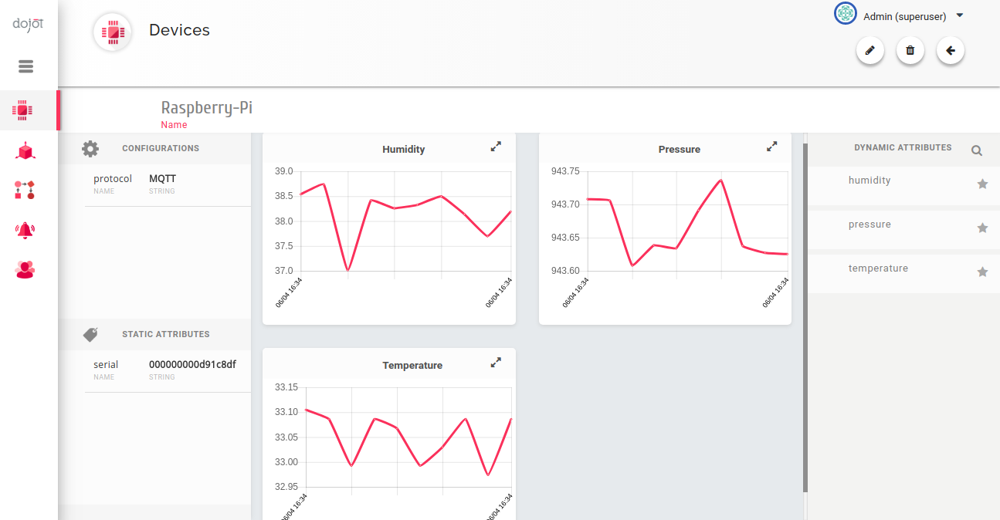
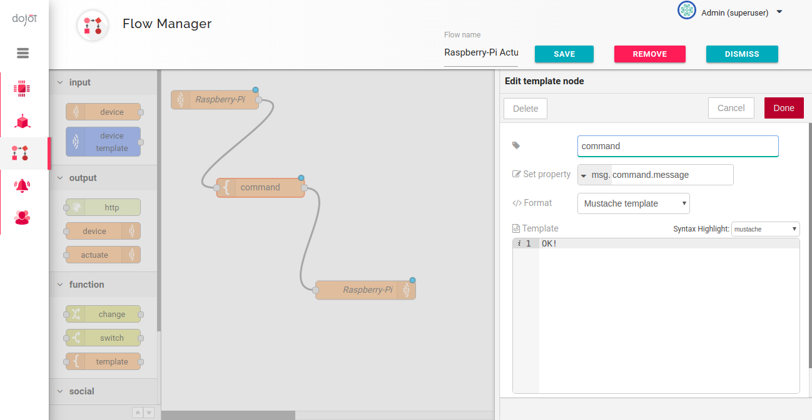
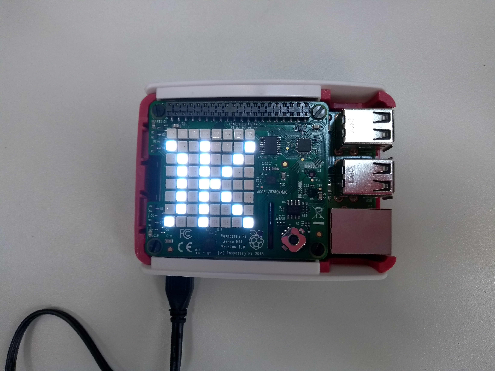
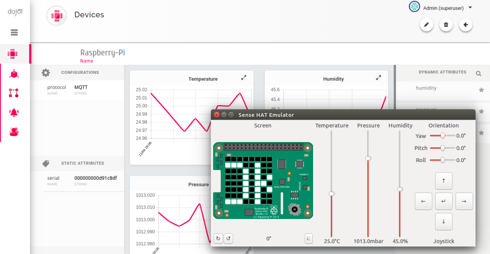

# Dojot Sense Hat Agent
It integrates Raspberry Pi - Sense Hat with dojot IoT platform.

The sensors (temperature, pressure, and humidity) are periodically read and their values are published
through MQTT protocol to dojot.

Using dojot flow processor you can also send a message to be shown on the Sense Hat display. The message
should be sent to MQTT topic ```/<tenant>/<device_id>/config``` with payload ```{"attrs": {"message": "<text>"}}```.

# Instructions

You'll need:

* [Running instance of dojot platform](http://dojotdocs.readthedocs.io/en/latest/installation-guide.html)
* [Raspberry Pi 3](https://www.raspberrypi.org/products/raspberry-pi-3-model-b)
* [Sense Hat](https://www.raspberrypi.org/products/sense-hat/)

In the Raspberry Pi 3, run:

```shell
> apt-get install sense-hat
> git clone https://github.com/rascaraficci/dojot-sense-hat.git
> cd dojot-sense-hat
> pip3 install -r requirements.txt
> python3 -m dojotsh.main -H <dojot HOST>
```

I advise to install *sense-hat* through *apt-get* instead of *pip* in order to avoid some dependency problems.

The `dojotsh.main` script will configure dojot with the template `Raspberry-Pi-Sense-Hat` and the device
`Raspberry-pi`, and start sending temperature, pressure and humidity data in intervals of 15 seconds.

The data will be available in dojot as illustrated in the image bellow.



You can actuate writing a processing flow as illustrated bellow.



For every message received by dojot, the flow is processed and an `OK!` is sent to
the Raspberry Pi that shows it in the Sense Hat Led Matrix.



# Usage

Some parameters of the script can be adjusted if necessary.

```shell
> python3 -m dojotsh.main -h
Usage: main.py [options]

Options:
  -h, --help            show this help message and exit
  -H HOST, --host=HOST  MQTT host to connect to. Defaults to localhost.
  -P PORT, --port=PORT  MQTT port to connect to. Defaults to 1883.
  -G GW, --api-gateway=GW
                        API Gateway to connect to. Defaults to localhost.
  -t TENANT, --tenant=TENANT
                        Tenant identifier in dojot. Defaults to admin.
  -u USER, --user=USER  User identifier in dojot. Defaults to admin.
  -p PASSWORD, --password=PASSWORD
                        User password in dojot. Defaults to admin.
  -s                    Enables https communication with dojot.
  -i INTERVAL, --interval=INTERVAL
                        Polling interval in seconds. Defaults to 15.
```

# What to do if I don't have a Sense Hat and not even a Raspberry pi?

You can emulate the Sense Hat on Linux using the
[Sense Hat Emulator](https://github.com/RPi-Distro/python-sense-emu).
In this case, you only need to replace the python package sense_hat by
the package sense-emu.

